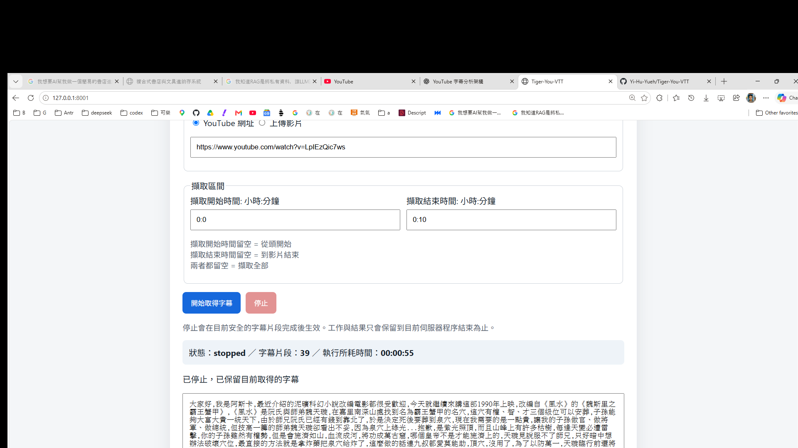
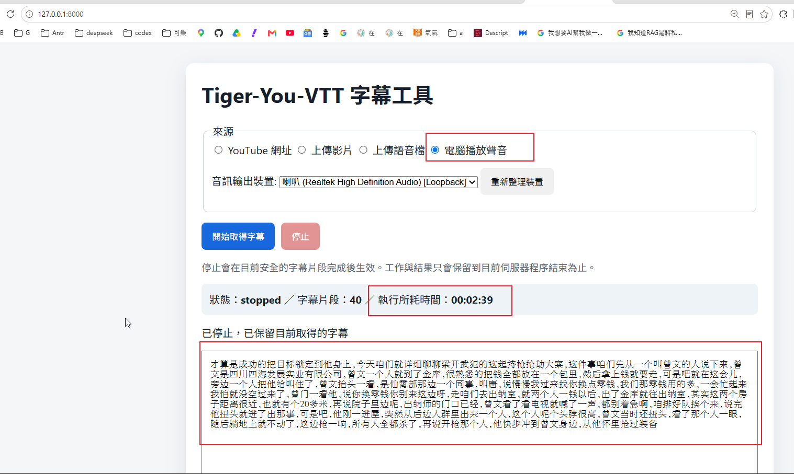
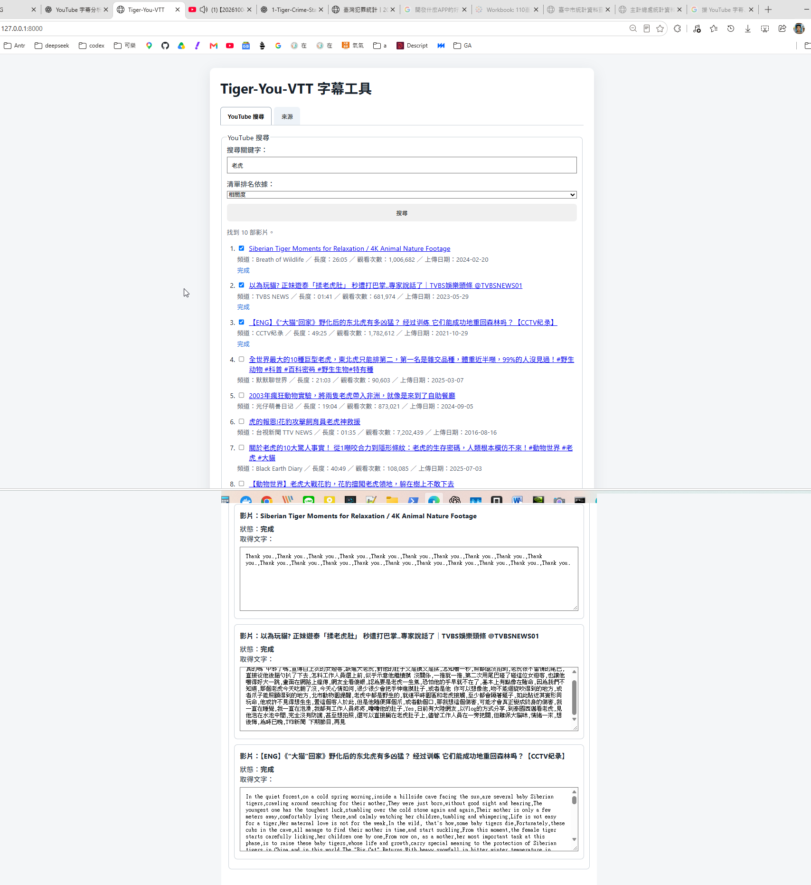

# Tiger-You-VTT

> YouTube 搜尋 / YouTube URL / 本機影片 / 語音檔 / Windows 系統音訊的字幕擷取與語音轉文字工具  
> 支援 YouTube 人工字幕、自動字幕、Embedded Text Subtitle、`faster-whisper` 本機 ASR、GPU/CPU fallback、WASAPI Loopback，以及多部 YouTube 影片依序取得字幕。

chatgpt: https://chatgpt.com/share/6ac07112-ac1c-83ee-910d-5a7d1d747d79

codex: https://chatgpt.com/s/cx_6ac07130c7708191a9b7e540db3563c8

github: https://github.com/Yi-Hu-Yueh/Tiger-You-VTT

[](LICENSE)


<!-- TOC:START -->
<a id="toc"></a>

## 📑 目錄索引

### ⚡ 快速跳轉

- [🚀 安裝與啟動](#section-4)
- [🧰 建立 venv](#create-venv)
- [▶️ 啟用虛擬環境](#activate-venv)
- [🔎 YouTube 搜尋](#youtube-search)
- [🖥️ UI 操作說明](#section-11)
- [🔌 API](#section-19)
- [🧪 執行測試](#section-28)
- [🛠️ 常見問題](#section-26)

### 完整目錄

**專案與功能**

1. [專案簡介](#section-1)
   - [YouTube 搜尋](#youtube-search)
   - YouTube URL / 本機影片 / 語音檔 / System Audio / Microphone
2. [主要功能](#section-2)
3. [License](#section-3)

**安裝與啟動**

4. [系統需求](#section-4)
5. [從 GitHub 下載](#section-5)
6. [Python 環境安裝](#section-6)
   - [建立 venv](#create-venv)
   - [啟用 venv](#activate-venv)
7. [CPU 模式](#section-7)
8. [NVIDIA GPU / CUDA](#section-8)
9. [啟動系統](#section-9)
   - [啟用虛擬環境](#activate-venv)
10. [開啟 UI](#section-10)

**操作與字幕處理**

11. [UI 操作說明](#section-11)
    - [YouTube 搜尋頁籤](#youtube-search-ui)
12. [擷取開始 / 結束時間](#section-12)
13. [開始取得字幕](#section-13)
14. [執行所耗時間](#section-14)
15. [STOP](#section-15)
16. [Live Audio Chunk](#section-16)
17. [輸出格式](#section-17)
18. [下載結果](#section-18)

**API 與 Runtime**

19. [API](#section-19)
20. [API 範例](#section-20)
    - [YouTube 搜尋 API 範例](#youtube-search-api-example)
21. [Job 狀態](#section-21)
22. [Whisper 設定](#section-22)
23. [Whisper 模型下載](#section-23)
24. [Windows WASAPI Loopback](#section-24)
25. [Microphone](#section-25)

**維護、測試與限制**

26. [常見問題](#section-26)
27. [專案目錄結構](#section-27)
28. [執行測試](#section-28)
29. [Git / 開發狀態](#section-29)
30. [安全與隱私](#section-30)
31. [已知限制](#section-31)
32. [建議操作流程](#section-32)
33. [最新驗證摘要](#section-33)
34. [MIT License](#section-34)

---
<!-- TOC:END -->

---

<a id="section-1"></a>
## 1. 專案簡介

Tiger-You-VTT 是一個以 **本機處理為主** 的字幕擷取與語音轉文字工具。

目前 UI 採兩個主要頁籤：

```text
[ YouTube 搜尋 ]   [ 來源 ]
```

- **YouTube 搜尋**：輸入關鍵字搜尋 YouTube、選擇排序方式、勾選影片，再依序取得字幕。
- **來源**：處理單一 YouTube URL、本機影片、本機語音檔、Windows 系統播放聲音，以及麥克風錄音模式。

### 目前來源能力

1. **YouTube 搜尋**
2. **YouTube URL**
3. **上傳影片**
4. **上傳語音檔**
5. **電腦播放聲音（Windows WASAPI Loopback）**
6. **麥克風錄音（Phase 2G implementation）**

> 麥克風功能的程式實作與自動化測試已完成，但目前開發機 Windows 沒有暴露可用的實體 microphone input device，因此真實麥克風硬體驗收仍為 pending。

---

<a id="youtube-search"></a>
## 1.1 YouTube 搜尋

流程：

```text
輸入關鍵字
↓
搜尋 YouTube
↓
選擇清單排名依據
├─ 相關度（預設）
├─ 最新上傳
├─ 觀看次數
└─ 影片長度
↓
顯示影片清單
↓
預設勾選前 3 部
↓
使用者可自由增減勾選
↓
每部勾選影片建立獨立的文字區塊
↓
按「開始取得字幕」
↓
依序處理勾選影片
```

### 搜尋排名

| UI 顯示 | 內部值 | 行為 |
|---|---|---|
| 相關度 | `relevance` | 保留 yt-dlp / YouTube 原生搜尋順序 |
| 最新上傳 | `upload_date` | 以 bounded candidate pool 取得 metadata 後，已知日期由新到舊 |
| 觀看次數 | `view_count` | 已知觀看次數由高到低 |
| 影片長度 | `duration` | 已知影片長度由短到長 |

除了「相關度」之外，第一版會使用：

```text
YOUTUBE_SEARCH_CANDIDATE_LIMIT = 30
```

先取得最多 30 個候選影片，再依指定欄位排序。

因此：

> 「最新上傳 / 觀看次數 / 影片長度」是針對這個 bounded candidate set 排序，不代表整個 YouTube 全站的全域排名。

### YouTube unavailable video 容錯

搜尋時某些影片可能：

- 已刪除
- 私人影片
- 地區限制
- 暫時不可用
- metadata 無法完整取得

目前設計是：

```text
30 個候選
↓
逐一取得 metadata
↓
某一支影片失敗
→ 跳過該候選
↓
其他候選繼續
↓
正常排序與顯示
```

不會因為單一不可用影片而讓整批搜尋失敗。

### 搜尋結果選取

一般 10 筆搜尋結果：

```text
☑ 1. Video A
☑ 2. Video B
☑ 3. Video C
☐ 4. Video D
☐ 5. Video E
...
```

規則：

- 第 1～3 部預設勾選
- 少於 3 部時，全部勾選
- 使用者可以取消任何影片
- 使用者也可以再勾第 4、5、6 部
- 沒有限制最多只能選 3 部

### 每部影片有獨立文字區塊

例如使用者最後選：

```text
#1
#3
#4
```

則 UI 會顯示：

```text
影片 #1
狀態：等待中
取得文字：
...

影片 #3
狀態：等待中
取得文字：
...

影片 #4
狀態：等待中
取得文字：
...
```

不同影片的 partial / final transcript 不會混在同一個文字框。

### YouTube 搜尋批次取得字幕

搜尋頁籤有自己的：

```text
[開始取得字幕] [停止]
```

它與「來源」頁籤原本的 Start / Stop 完全分開。

勾選多部影片時：

```text
Video A
→ terminal state
→ Video B
→ terminal state
→ Video C
```

採 **sequential processing**，不會同時執行多個 large-v3 Whisper job。

目前搜尋清單啟動字幕時使用：

```text
start_time = 0:0
end_time = 0:10
end_time_is_default = true
```

也就是沿用專案既有的「預設前 10 分鐘」語意。

### 搜尋專用 STOP

如果：

```text
A = 完成
B = 處理中
C = 等待中
```

按下搜尋頁籤自己的 `停止`：

```text
A → 保持完成
B → stopping → stopped
C → 不再啟動
```

STOP 不會影響「來源」頁籤其他 Job。

---

## 1.2 YouTube URL

```text
YouTube URL
    ↓
檢查 YouTube 字幕
    ├─ 有人工字幕 / 自動字幕
    │   → 直接取得字幕
    │
    └─ 沒有可用字幕
        → 下載 audio-only
        → faster-whisper
        → 語音轉文字
```

---

## 1.3 本機影片

```text
上傳影片
    ↓
FFprobe 檢查媒體 streams
    ↓
有 Embedded Text Subtitle？
    ├─ 有
    │   → FFmpeg 擷取文字字幕
    │
    └─ 沒有
        → 檢查 audio
        → faster-whisper
```

---

## 1.4 本機語音檔

```text
上傳語音檔
    ↓
FFprobe 驗證
    ↓
faster-whisper
    ↓
TranscriptSegment[]
    ↓
TXT / VTT / SRT
```

常見支援副檔名：

```text
.mp3
.wav
.m4a
.aac
.flac
.ogg
.opus
.wma
```

---

## 1.5 Windows 電腦播放聲音

```text
Chrome / Edge / VLC / PotPlayer / Spotify / 其他程式
                    ↓
          Windows 音訊輸出裝置
                    ↓
              WASAPI Loopback
                    ↓
            PCM Audio Chunk
                    ↓
             faster-whisper
                    ↓
             即時累積字幕
```

> 此模式擷取的是指定 Windows output device 的**混合聲音**，不是只擷取某一個 Chrome 分頁或單一應用程式。

---

## 1.6 麥克風錄音

Phase 2G 已建立：

```text
Microphone Input Device
↓
PCM bounded chunks
↓
existing faster-whisper
↓
live TranscriptSegment[]
↓
TXT / VTT / SRT
```

相關功能：

- 麥克風裝置列舉
- default microphone 選擇
- blocking input capture
- bounded WAV chunks
- live silence policy
- cooperative STOP
- session-relative timestamp
- 與 system-audio device list 分離

目前開發機實際結果：

```text
可用 microphone input device = 0
```

因此真實 microphone PCM / transcription gate 尚未完成。

---

## 1.7 統一輸出

所有來源最終統一成：

- `TranscriptSegment[]`
- `TXT`
- `VTT`
- `SRT`

TXT segment 使用英文半形逗號 `,` 串接：

```text
句子1,句子2,句子3
```







---

<a id="section-2"></a>
## 2. 主要功能

- ✅ YouTube 關鍵字搜尋
- ✅ YouTube 搜尋排序：相關度 / 最新上傳 / 觀看次數 / 影片長度
- ✅ YouTube unavailable candidate 容錯
- ✅ YouTube 搜尋結果 checkbox
- ✅ 預設勾選前 3 部影片
- ✅ 多部搜尋結果依序取得字幕
- ✅ 每部搜尋影片獨立 transcript panel
- ✅ YouTube 搜尋專用 Start / Stop
- ✅ `YouTube 搜尋` / `來源` 雙頁籤
- ✅ 頁籤切換保留 UI state
- ✅ YouTube URL 單一入口
- ✅ 自動偵測人工字幕
- ✅ 自動偵測 YouTube 自動字幕
- ✅ 無 YouTube 字幕時自動使用 `faster-whisper`
- ✅ 本機影片上傳
- ✅ 自動擷取影片 Embedded Text Subtitle
- ✅ 無 Embedded Text Subtitle 時自動使用 `faster-whisper`
- ✅ 本機語音檔上傳轉文字
- ✅ Windows WASAPI Loopback 電腦播放聲音即時轉文字
- ✅ 麥克風錄音 implementation（真實硬體驗收 pending）
- ✅ 本機 GPU / CPU 語音辨識
- ✅ NVIDIA GPU CUDA 加速
- ✅ GTX 1070 + `cuda/int8_float32` 實機驗證
- ✅ CUDA 失敗時 CPU `int8` fallback
- ✅ Whisper file-mode VAD 空結果時可安全重試
- ✅ Live audio 靜音 chunk 不做 VAD-off hallucination retry
- ✅ H:M 擷取開始 / 結束時間
- ✅ Background Job
- ✅ partial transcript
- ✅ elapsed timer
- ✅ cooperative STOP
- ✅ STOP 後保留目前已取得文字
- ✅ STOP 後仍可保留部分 TXT / VTT / SRT
- ✅ FFmpeg / FFprobe 媒體檢查
- ✅ 暫存媒體 / PCM chunk 自動清除
- ✅ Swagger API 文件
- ✅ 本機 Web UI

---

<a id="section-3"></a>
## 3. License

本專案使用 **MIT License**。

```text
MIT License

Copyright (c) 2026 Tiger (樂以虎@Taiwan)
```

詳見：

```text
LICENSE
```

---

<a id="section-4"></a>
# 4. 系統需求

## 4.1 基本需求

建議：

- Windows 10 / Windows 11
- Python **3.11+**
- Git
- FFmpeg / FFprobe
- 至少 8 GB RAM
- 建議 16 GB RAM 以上

主要開發 / 驗證環境：

```text
Python 3.11.3
Windows 11
RAM 16 GB
GPU NVIDIA GeForce GTX 1070 8 GB
```

> `電腦播放聲音` 與目前的 microphone capture implementation 都以 Windows / PyAudioWPatch 為主要驗證環境。

---

## 4.2 FFmpeg / FFprobe

```powershell
ffmpeg -version
ffprobe -version
```

FFmpeg：

https://ffmpeg.org/

---

<a id="section-5"></a>
# 5. 從 GitHub 下載

GitHub：

https://github.com/Yi-Hu-Yueh/Tiger-You-VTT

## 方法 A：Git Clone

```powershell
git clone https://github.com/Yi-Hu-Yueh/Tiger-You-VTT.git
cd Tiger-You-VTT
```

## 方法 B：Download ZIP

```text
GitHub
→ Code
→ Download ZIP
```

---

<a id="section-6"></a>
# 6. Python 環境安裝

<a id="create-venv"></a>
## 6.1 建立與啟用虛擬環境

先確認目前位於專案根目錄：

```powershell
cd D:\0TIGER\6months\PythonAPIDevelopment\Tiger-You-VTT
```

> 從 GitHub 下載到其他路徑時，請改成你自己的 `Tiger-You-VTT` 專案路徑。

先建立 `.venv`：

```powershell
python -m venv .venv
```

建立完成後，先確認啟動腳本真的存在：

```powershell
Test-Path .\.venv\Scripts\Activate.ps1
```

正常應回傳：

```text
True
```

再啟用虛擬環境：

```powershell
.\.venv\Scripts\Activate.ps1
```

成功後，PowerShell 提示字元前方通常會看到：

```text
(.venv)
```

> 如果 `Activate.ps1` 出現 `The term '.\\.venv\\Scripts\\Activate.ps1' is not recognized...`，這通常不是 Execution Policy 問題，而是 `.venv` 尚未建立、建立失敗，或目前不在正確的專案目錄。先重新執行 `python -m venv .venv`，再用 `Test-Path` 確認檔案存在。

只有在 `Test-Path` 已經是 `True`，但 PowerShell 顯示腳本被執行政策阻擋時，才執行：

```powershell
Set-ExecutionPolicy -Scope Process -ExecutionPolicy Bypass
.\.venv\Scripts\Activate.ps1
```

---

## 6.2 安裝套件

```powershell
python -m pip install --upgrade pip
python -m pip install -r requirements.txt
```

主要 Runtime 套件包括：

- FastAPI
- Uvicorn
- yt-dlp
- webvtt-py
- faster-whisper
- CTranslate2
- PyAV
- python-multipart
- httpx
- **PyAudioWPatch**

目前已驗證：

```text
yt-dlp          2026.08.19
faster-whisper  1.2.1
CTranslate2     4.8.2
PyAV            18.1.0
PyAudioWPatch   0.2.12.8
```

---

<a id="section-7"></a>
# 7. CPU 模式

```powershell
$env:WHISPER_DEVICE="cpu"
$env:WHISPER_COMPUTE_TYPE="int8"
```

啟動：

```powershell
python -m uvicorn app.main:app --host 127.0.0.1 --port 8000
```

CPU 不需要 CUDA，但 `large-v3` 對長音訊可能較慢。

---

<a id="section-8"></a>
# 8. NVIDIA GPU / CUDA

推薦一般設定：

```powershell
$env:WHISPER_DEVICE="auto"
$env:WHISPER_COMPUTE_TYPE="auto"
```

已驗證：

```text
GPU                  NVIDIA GeForce GTX 1070 8 GB
Whisper model        large-v3
Working device       cuda
Working compute      int8_float32
```

### 短樣本實測

```text
CPU int8             約 121.484 秒
GPU int8_float32     約   5.435 秒
```

單次短樣本純 inference 約：

```text
22.35x
```

> 只代表該次樣本，不應直接外推成所有影片固定倍率。

---

## 8.1 `cublas64_12.dll` 找不到

若出現：

```text
RuntimeError: Library cublas64_12.dll is not found or cannot be loaded
```

可設定：

```text
WHISPER_CUDA_RUNTIME_DIR
```

例如：

```powershell
$env:WHISPER_CUDA_RUNTIME_DIR="D:\path\to\cuda-runtime-dlls"
```

專案支援 process-local DLL search path，不需要因此修改全域 Windows 設定。

---

<a id="section-9"></a>
# 9. 啟動系統

先進入專案資料夾：

```powershell
cd D:\0TIGER\6months\PythonAPIDevelopment\Tiger-You-VTT
```

<a id="activate-venv"></a>
## 9.1 啟用虛擬環境

一般 GitHub / ZIP 使用者先確認 `.venv` 是否已建立：

```powershell
Test-Path .\.venv\Scripts\Activate.ps1
```

如果回傳：

```text
False
```

先建立 venv：

```powershell
python -m venv .venv
```

再啟用：

```powershell
.\.venv\Scripts\Activate.ps1
```

成功後會看到類似：

```text
(.venv)
```

本專案目前開發機則可直接使用既有共享環境：

```powershell
D:\0TIGER\6months\PythonAPIDevelopment\venv_multi_query\Scripts\Activate.ps1
```

成功後會看到類似：

```text
(venv_multi_query)
```

> 一般從 GitHub 下載本專案的使用者，建議使用專案自己的 `.venv`；`venv_multi_query` 是目前開發機既有的共享環境，不是 GitHub 專案內附的資料夾。

若 `Test-Path` 已是 `True`，但 PowerShell 顯示 Execution Policy 阻擋，再執行：

```powershell
Set-ExecutionPolicy -Scope Process -ExecutionPolicy Bypass
.\.venv\Scripts\Activate.ps1
```

## 9.2 啟動 Server

確認已進入虛擬環境後執行：

```powershell
python -m uvicorn app.main:app --host 127.0.0.1 --port 8000
```

成功後：

```text
Uvicorn running on http://127.0.0.1:8000
```

若 `8000` 已被占用：

```powershell
python -m uvicorn app.main:app --host 127.0.0.1 --port 8001
```

---

<a id="section-10"></a>
# 10. 開啟 UI

```text
http://127.0.0.1:8000/
```

Swagger：

```text
http://127.0.0.1:8000/docs
```

---

<a id="section-11"></a>
# 11. UI 操作說明

UI 最上方有兩個主要頁籤：

```text
[ YouTube 搜尋 ]   [ 來源 ]
```

預設：

```text
YouTube 搜尋 = 顯示
來源 = 隱藏
```

頁籤切換只影響顯示，不會清除已輸入或已搜尋的狀態。

---

<a id="youtube-search-ui"></a>
## 11.1 YouTube 搜尋頁籤

輸入：

```text
搜尋關鍵字：Tiger

清單排名依據：
[ 相關度 ▼ ]

[搜尋]
```

排名選項：

```text
相關度
最新上傳
觀看次數
影片長度
```

搜尋完成後：

```text
☑ 1. Video A
☑ 2. Video B
☑ 3. Video C
☐ 4. Video D
...
```

下方立即出現三個獨立文字區塊：

```text
Video A
狀態：等待中
取得文字：...

Video B
狀態：等待中
取得文字：...

Video C
狀態：等待中
取得文字：...
```

取消 Video B：

```text
☑ A
☐ B
☑ C
```

則 Video B 的文字區塊立即移除。

勾選 Video D：

```text
☑ A
☐ B
☑ C
☑ D
```

則下方顯示：

```text
A panel
C panel
D panel
```

---

## 11.2 YouTube 搜尋批次處理

按：

```text
開始取得字幕
```

選中的影片依序執行：

```text
等待中
→ 處理中
→ 完成 / 已停止 / 失敗
```

每部影片的 partial / final `txt` 只更新到自己的 panel。

如果某一部失敗：

```text
Video A 完成
Video B 失敗
Video C 繼續執行
```

單部失敗不會讓整個批次直接中止。

---

## 11.3 YouTube 搜尋 STOP

按 YouTube 搜尋頁籤自己的：

```text
停止
```

只停止目前 Search Batch。

例如：

```text
A 完成
B 處理中
C 等待中
```

STOP 後：

```text
A 完成
B 已停止
C 等待中（不再啟動）
```

---

## 11.4 來源頁籤

來源頁籤保留：

```text
○ YouTube 網址
○ 上傳影片
○ 上傳語音檔
○ 電腦播放聲音
○ 麥克風錄音
```

其中麥克風模式在目前開發機沒有可用實體 input device，因此真實硬體驗收尚未完成。

---

## 11.5 YouTube URL

```text
人工字幕
↓ 沒有
自動字幕
↓ 沒有
audio-only
↓
faster-whisper
```

---

## 11.6 上傳影片

常見副檔名：

```text
.mp4
.mov
.mkv
.avi
.webm
.flv
.wmv
.mpeg
.mpg
```

---

## 11.7 上傳語音檔

常見副檔名：

```text
.mp3
.wav
.m4a
.aac
.flac
.ogg
.opus
.wma
```

---

## 11.8 電腦播放聲音

```text
選擇 WASAPI Loopback
→ 開始取得字幕
→ bounded PCM chunks
→ faster-whisper
→ live transcript
```

這是 mixed output audio，不是單一 application capture。

---

## 11.9 麥克風錄音

```text
選擇 microphone
→ 開始取得字幕
→ PCM chunks
→ faster-whisper
→ live transcript
```

若沒有可用 input device，API 會回 controlled `microphone_device_not_found`。

---

<a id="section-12"></a>
# 12. 擷取開始 / 結束時間

有限長度來源：

```text
擷取開始時間: 小時:分鐘
擷取結束時間: 小時:分鐘
```

格式：

```text
H:M
```

預設：

```text
0:0 → 0:10
```

若 `0:10` 仍是 untouched default，而媒體短於 10 分鐘，會自動 clamp 到實際 media end。

System Audio / Microphone 為 live source，不使用 H:M range。

---

<a id="section-13"></a>
# 13. 開始取得字幕

一般「來源」頁籤：

```text
[開始取得字幕] [停止]
```

YouTube 搜尋頁籤則有自己獨立的：

```text
[開始取得字幕] [停止]
```

兩組控制不共用 active job ID。

---

<a id="section-14"></a>
# 14. 執行所耗時間

格式：

```text
HH:MM:SS
```

包含：

```text
queued
running
stopping
```

以下狀態後 freeze：

```text
completed
stopped
failed
```

---

<a id="section-15"></a>
# 15. STOP

STOP 為 cooperative cancellation：

```text
running
→ stopping
→ stopped
```

不強制 kill Python / Whisper thread。

已完成的 segment 會保留。

---

<a id="section-16"></a>
# 16. Live Audio Chunk

System Audio 預設：

```text
SYSTEM_AUDIO_CHUNK_SECONDS = 10
```

Microphone：

```text
MICROPHONE_CHUNK_SECONDS = 10
```

Live source 的 silence / VAD-empty chunk：

```text
0 segments
→ 正常
→ Job 繼續
→ 不做 vad_filter=False retry
```

避免靜音時產生不必要的 hallucinated transcript。

---

<a id="section-17"></a>
# 17. 輸出格式

## TXT

```text
第一句,第二句,第三句
```

## VTT

```text
WEBVTT

00:01:00.000 --> 00:01:03.200
第一句
```

## SRT

```text
1
00:01:00,000 --> 00:01:03,200
第一句
```

## TranscriptSegment

```json
{
  "start": 60.0,
  "end": 63.2,
  "text": "第一句"
}
```

System Audio / Microphone 使用 session-relative timeline。

---

<a id="section-18"></a>
# 18. 下載結果

一般單一來源完成或停止後可下載：

- TXT
- VTT
- SRT

目前 YouTube Search 多影片 panel 階段，重點是每部影片獨立文字區塊與狀態；尚未加入：

- combined TXT
- combined VTT
- combined SRT
- ZIP
- merged transcript

---

<a id="section-19"></a>
# 19. API

Swagger：

```text
http://127.0.0.1:8000/docs
```

| Method | Endpoint | 用途 |
|---|---|---|
| GET | `/health` | Health check |
| GET | `/` | Web UI |
| GET | `/api/youtube/search` | YouTube 關鍵字搜尋 |
| POST | `/api/youtube/info` | YouTube metadata / subtitle tracks |
| POST | `/api/youtube/subtitle` | 同步取得 YouTube 字幕 / Whisper fallback |
| POST | `/api/video/subtitle` | 同步處理上傳影片 |
| POST | `/api/audio/transcript` | 同步處理語音檔 |
| POST | `/api/jobs/youtube` | 建立 YouTube Background Job |
| POST | `/api/jobs/video` | 建立 Video Background Job |
| POST | `/api/jobs/audio` | 建立 Audio Background Job |
| GET | `/api/system-audio/devices` | 列出 WASAPI Loopback devices |
| POST | `/api/jobs/system-audio` | 建立 system-audio Live Job |
| GET | `/api/microphone/devices` | 列出 microphone input devices |
| POST | `/api/jobs/microphone` | 建立 microphone Live Job |
| GET | `/api/jobs/{job_id}` | Job status / partial transcript / elapsed |
| POST | `/api/jobs/{job_id}/stop` | Cooperative STOP |

---

<a id="section-20"></a>
# 20. API 範例

<a id="youtube-search-api-example"></a>
## 20.1 YouTube 搜尋

```bash
curl "http://127.0.0.1:8000/api/youtube/search?q=Agentic%20RAG&sort=relevance&limit=10"
```

最新上傳：

```bash
curl "http://127.0.0.1:8000/api/youtube/search?q=Tiger&sort=upload_date&limit=10"
```

---

## 20.2 YouTube URL

```bash
curl -X POST \
  "http://127.0.0.1:8000/api/youtube/subtitle" \
  -H "Content-Type: application/json" \
  -d '{
    "url": "https://www.youtube.com/watch?v=VIDEO_ID",
    "start_time": "0:0",
    "end_time": "0:10"
  }'
```

---

## 20.3 上傳影片

```bash
curl -X POST \
  "http://127.0.0.1:8000/api/video/subtitle" \
  -F "file=@example.mp4" \
  -F "start_time=0:0" \
  -F "end_time=0:10"
```

---

## 20.4 上傳語音檔

```bash
curl -X POST \
  "http://127.0.0.1:8000/api/audio/transcript" \
  -F "file=@speech.mp3" \
  -F "start_time=0:0" \
  -F "end_time=0:10"
```

---

## 20.5 System Audio Devices

```bash
curl "http://127.0.0.1:8000/api/system-audio/devices"
```

---

## 20.6 Microphone Devices

```bash
curl "http://127.0.0.1:8000/api/microphone/devices"
```

---

<a id="section-21"></a>
# 21. Job 狀態

```text
queued
running
stopping
stopped
completed
failed
```

Job 目前只存在 Uvicorn process memory。

Server restart 後不保留舊 Job。

---

<a id="section-22"></a>
# 22. Whisper 設定

```text
WHISPER_MODEL
WHISPER_DEVICE
WHISPER_COMPUTE_TYPE
WHISPER_CUDA_RUNTIME_DIR
SYSTEM_AUDIO_CHUNK_SECONDS
MICROPHONE_CHUNK_SECONDS
```

預設模型：

```text
large-v3
```

---

<a id="section-23"></a>
# 23. Whisper 模型下載

Whisper lazy-load。

第一次真正需要 ASR 時可能下載 `large-v3`。

YouTube Search 本身只搜尋 metadata，不會因為按「搜尋」而啟動 Whisper。

只有使用者明確按：

```text
開始取得字幕
```

才會開始進入現有 YouTube subtitle / Whisper pipeline。

---

<a id="section-24"></a>
# 24. Windows WASAPI Loopback

使用：

```text
PyAudioWPatch
```

已驗證：

```text
喇叭 (Realtek High Definition Audio) [Loopback]
sample rate: 48000 Hz
channels: 2
```

System Audio device list 不包含 microphone。

---

<a id="section-25"></a>
# 25. Microphone

Microphone list 只接受正常 input devices，不接受 WASAPI Loopback。

目前開發機 PyAudioWPatch inventory 有裝置，但：

```text
regular microphone input channels = 0
```

所以：

```text
GET /api/microphone/devices
→ 0 usable microphone devices
```

這是目前 Phase 2G real hardware gate 尚未通過的原因。

---

<a id="section-26"></a>
# 26. 常見問題

## 26.1 Port 8000 已被占用

```powershell
Get-NetTCPConnection -LocalPort 8000 -State Listen
```

或：

```powershell
python -m uvicorn app.main:app --host 127.0.0.1 --port 8001
```

---

## 26.2 YouTube 最新上傳搜尋失敗

目前已修復 candidate-level failure。

以前：

```text
其中 1 支 unavailable
→ DownloadError
→ 整個搜尋失敗
```

現在：

```text
其中 1 支 unavailable
→ skip candidate
→ 其他影片繼續
→ 正常顯示清單
```

---

## 26.3 YouTube 搜尋的排序不是全站排名？

對。

除了原生 relevance 之外：

```text
最新上傳
觀看次數
影片長度
```

目前是針對 bounded candidate pool 排序。

預設：

```text
30 candidates
```

---

## 26.4 yt-dlp JavaScript Runtime Warning

目前某些 YouTube metadata extraction 可能出現：

```text
missing supported JavaScript runtime
```

在已驗證情境中此 warning 非 blocking，搜尋仍成功。

目前沒有為了消除 warning 額外安裝 Node.js。

---

## 26.5 YouTube 有畫面字幕但找不到字幕軌

可能是：

```text
burned-in subtitle
```

目前不做 OCR。

---

## 26.6 Whisper 空轉錄

有限媒體 file mode：

```text
vad_filter=True
→ 自然 0 usable segments
→ retry once with vad_filter=False
```

Live audio：

```text
vad_filter=True
→ 0 usable segments
→ 接受空 chunk
→ 不做 VAD-off retry
```

---

## 26.7 GPU 失敗

```text
CUDA inference failure
→ CPU int8 fallback
```

---

## 26.8 電腦播放聲音沒有字幕

確認：

1. UI 選取的 output device 是否正確
2. Windows 是否真的有聲音播放
3. 是否選到 `[Loopback]`
4. 是否中途切換 Bluetooth / Headphones
5. Job 是否仍 running

---

## 26.9 麥克風清單是空的

確認 Windows：

```text
設定
→ 系統
→ 音效
→ 輸入
```

也確認：

```text
設定
→ 隱私權與安全性
→ 麥克風
→ 允許桌面應用程式存取
```

若 Windows/PortAudio 本身沒有暴露 input device，Tiger-You-VTT 不會把 system loopback 假裝成 microphone。

---

<a id="section-27"></a>
# 27. 專案目錄結構

```text
Tiger-You-VTT/
│
├─ app/
│  ├─ main.py
│  ├─ config.py
│  │
│  ├─ routers/
│  │  ├─ youtube.py
│  │  ├─ video.py
│  │  ├─ audio.py
│  │  ├─ system_audio.py
│  │  ├─ microphone.py
│  │  ├─ jobs.py
│  │  └─ ui.py
│  │
│  ├─ schemas/
│  │  ├─ youtube.py
│  │  ├─ video.py
│  │  ├─ audio.py
│  │  ├─ system_audio.py
│  │  ├─ microphone.py
│  │  ├─ transcript.py
│  │  └─ jobs.py
│  │
│  ├─ services/
│  │  ├─ youtube.py
│  │  ├─ youtube_search.py
│  │  ├─ video.py
│  │  ├─ audio.py
│  │  ├─ system_audio.py
│  │  ├─ microphone.py
│  │  ├─ whisper.py
│  │  ├─ transcript.py
│  │  ├─ media_range.py
│  │  ├─ jobs.py
│  │  └─ errors.py
│  │
│  └─ static/
│     └─ index.html
│
├─ tests/
├─ pics/
├─ requirements.txt
├─ requirements-dev.txt
├─ LICENSE
└─ README.md
```

---

<a id="section-28"></a>
# 28. 執行測試

```powershell
python -m pip install -r requirements-dev.txt
python -m pytest -q
```

目前最新開發 working tree 已驗證：

```text
322 passed
0 failed
0 skipped
```

另有：

```text
1 個既有 pytest cache permission warning
```

測試涵蓋：

- YouTube subtitle
- YouTube Whisper fallback
- YouTube keyword search
- relevance / upload_date / view_count / duration ranking
- unavailable candidate tolerance
- search-result checkbox selection
- default first-three selection
- tab switching / state preservation
- per-video transcript panels
- sequential search-result jobs
- Search-specific STOP
- Embedded subtitle
- Uploaded video
- Uploaded audio
- WASAPI device enumeration
- System Audio capture
- Microphone device/capture behavior
- FFmpeg / FFprobe
- Whisper CPU / GPU
- CUDA fallback
- VAD retry
- H:M range
- timestamp offset
- STOP
- partial transcript
- Job lifecycle
- elapsed timer
- UI

---

<a id="section-29"></a>
# 29. Git / 開發狀態

目前已推送的 GitHub `main` baseline：

```text
98113498ee1036a802f953cbff53c58b11178b10
```

Commit：

```text
feat: add audio and Windows system audio transcription
```

目前較新的 Phase 2G / Phase 2H 功能仍位於 working tree，尚未 commit/push。

因此 GitHub `main` 與目前本機最新開發 UI 可能存在差異。

---

<a id="section-30"></a>
# 30. 安全與隱私

- Whisper inference 在本機
- System Audio capture 在本機
- Microphone capture 在本機
- 不使用雲端 ASR API
- 不使用 Qwen / OpenAI / Ollama / LangChain 做字幕分析
- YouTube Search 只取得 metadata
- YouTube Search 本身不下載影片 / 音訊 / 字幕
- 上傳媒體使用 temporary storage
- Live PCM chunk 處理後刪除
- 不保存完整 system/microphone recording
- subprocess 不使用 `shell=True`
- 有 upload size 限制
- YouTube 路徑需要網路
- Whisper model 首次下載需要網路

---

<a id="section-31"></a>
# 31. 已知限制

1. STOP 為 cooperative cancellation，不保證瞬間中斷正在 inference 的 segment。
2. Job 儲存在記憶體，Server restart 後不保留。
3. Burned-in subtitle 尚未做 OCR。
4. `large-v3` CPU 模式可能很慢。
5. GPU 加速依賴 CUDA Runtime 相容性。
6. H:M 只接受「小時:分鐘」，不接受秒。
7. System Audio 為 selected output device 的 mixed audio。
8. System Audio 不隔離單一 application。
9. 執行中切換 Windows output device 不會自動跟隨。
10. 第一個 Whisper chunk 可能受模型首次載入影響而較慢。
11. Microphone 功能需要 Windows/PortAudio 實際暴露 input device。
12. 目前開發機尚無可用 microphone input，因此 Phase 2G real hardware acceptance pending。
13. YouTube `最新上傳 / 觀看次數 / 影片長度` 為 bounded candidate-set 排序。
14. yt-dlp metadata extraction 可能遇到 unavailable video；目前會跳過個別失敗 candidate。
15. YouTube Search 多影片目前採 sequential processing，不做 concurrent Whisper。
16. YouTube Search 尚未提供 combined/merged transcript 或 ZIP。

---

<a id="section-32"></a>
# 32. 建議操作流程

## YouTube 搜尋

```text
1. 啟動 Server
2. 開啟 http://127.0.0.1:8000/
3. 預設進入「YouTube 搜尋」
4. 輸入搜尋關鍵字
5. 選擇排名方式
6. 按「搜尋」
7. 預設前 3 部影片會被勾選
8. 依需求增加或取消勾選
9. 確認下方每部 selected video 都有自己的文字區塊
10. 按 YouTube 搜尋自己的「開始取得字幕」
11. 影片依序處理
12. 每部 partial/final text 顯示在自己的 panel
13. 如需提前停止，按搜尋頁籤自己的「停止」
```

## 一般來源

```text
1. 切換到「來源」
2. 選擇：
   - YouTube 網址
   - 上傳影片
   - 上傳語音檔
   - 電腦播放聲音
   - 麥克風錄音
3. 有限媒體確認 H:M
4. Live source 選擇正確 device
5. 按「開始取得字幕」
6. 觀察 status / elapsed / partial transcript
7. 必要時按 STOP
8. 下載 TXT / VTT / SRT
```

---

<a id="section-33"></a>
# 33. 最新驗證摘要

目前最新 working tree：

```text
322 passed
0 failed
0 skipped
```

已完成實機驗證的重點包括：

- GTX 1070 CUDA `int8_float32`
- YouTube direct URL
- YouTube Search relevance
- `Tiger + 最新上傳`
- unavailable-video candidate skip
- view-count sorting
- duration sorting
- default first-three checkboxes
- YouTube Search independent Start / Stop
- sequential selected-video processing
- tab switching
- per-selected-video transcript panels
- WASAPI Loopback PCM capture
- System Audio transcription / STOP

目前仍未完成的主要 real hardware gate：

```text
Microphone real device / PCM / transcription
```

原因：

```text
Windows / PyAudioWPatch 沒有暴露 usable microphone input device
```

---

<a id="section-34"></a>
# 34. MIT License

本專案依 MIT License 發布。

你可以自由：

- 使用
- 複製
- 修改
- 合併
- 發布
- 散布
- 再授權
- 銷售軟體副本

前提是保留原始版權與授權聲明。

詳見：

[LICENSE](LICENSE)

---

## Repository

**Tiger-You-VTT**

https://github.com/Yi-Hu-Yueh/Tiger-You-VTT

---

Copyright © 2026 Tiger (樂以虎@Taiwan)
